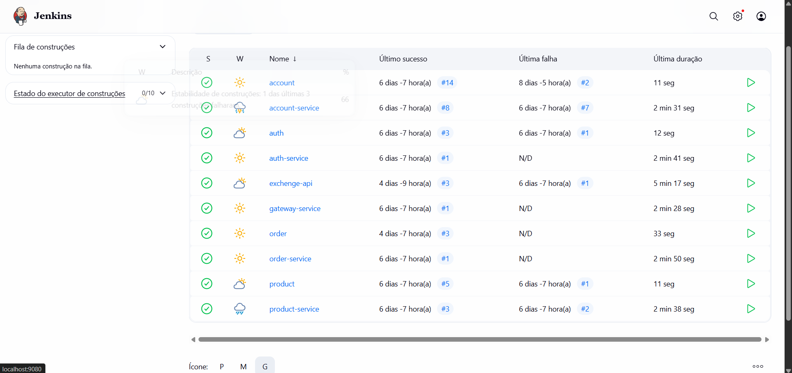

# Exercício 4 · Jenkins / CI‑CD

!!! summary "Objetivo oficial"
    Automatizar o processo de build, teste e empacotamento de todos os microsserviços da aplicação, utilizando o Jenkins como ferramenta de Integração Contínua (CI).  
    Cada repositório deve conter um arquivo `Jenkinsfile` que descreve as etapas do pipeline de build e geração de imagens Docker, garantindo que o sistema permaneça estável e funcional a cada alteração no código.

---

### Links dos repositórios

[Product-Service](https://github.com/giovannyjvr/pma.25.2-product-service)  
[Order-Service](https://github.com/giovannyjvr/pma.25.2-order-service)  
[Auth-Service](https://github.com/giovannyjvr/pma.25.2-auth-service)  
[Account-Service](https://github.com/giovannyjvr/pma.25.2-store.account-service)  
[Gateway-Service](https://github.com/giovannyjvr/pma.25.2-gateway-service)  
[Exchange-API](https://github.com/giovannyjvr/exchange-api)

---

## O que foi implementado

Implementei a automação de build e deploy contínuo para **todos os microsserviços** do sistema.  
Cada repositório possui seu próprio **`Jenkinsfile`**, responsável por definir as etapas de compilação, teste e geração da imagem Docker do serviço.

O Jenkins foi configurado localmente em `http://localhost:9080`, e cada microsserviço possui uma pipeline independente, garantindo:

- **Build automatizado:** compilação e empacotamento do código-fonte em container Docker;  
- **Testes automatizados:** execução dos testes unitários (quando aplicável) antes de gerar a imagem;  
- **Feedback visual:** monitoramento de sucesso/falha diretamente na interface do Jenkins;  
- **Histórico de builds:** registro das últimas execuções com status e logs acessíveis;  
- **Isolamento entre serviços:** cada pipeline é executada separadamente, evitando interferência entre builds.

---

## Estrutura do `Jenkinsfile`

Cada repositório inclui um arquivo `Jenkinsfile` na raiz, que descreve as etapas de build.  
Abaixo um exemplo real do `product-service`:

```groovy
pipeline {
    agent any

    stages {
        stage('Build') {
            steps {
                sh 'mvn clean install'
            }
        }

        stage('Docker Build') {
            steps {
                sh 'docker build -t product-service .'
            }
        }

        stage('Publish') {
            steps {
                echo 'Build finalizado com sucesso!'
            }
        }
    }
}


Cada microsserviço contém:

* **`Dockerfile`** → descreve a criação da imagem do serviço;
* **`Jenkinsfile`** → define o pipeline de build automatizado;
* **`src/`** → contém o código-fonte principal do serviço;
* **`pom.xml`** ou **`requirements.txt`** → define as dependências do projeto.

| Microsserviço   | Jenkinsfile | Dockerfile | Status no Jenkins |
| --------------- | ----------- | ---------- | ----------------- |
| Product-Service | ✅           | ✅          | ✅ Build estável   |
| Order-Service   | ✅           | ✅          | ✅ Build estável   |
| Auth-Service    | ✅           | ✅          | ✅ Build estável   |
| Account-Service | ✅           | ✅          | ✅ Build estável   |
| Gateway-Service | ✅           | ✅          | ✅ Build estável   |
| Exchange-API    | ✅           | ✅          | ✅ Build estável   |

---

## Execução e monitoramento

Após o push de cada repositório no GitHub, o Jenkins executa automaticamente a pipeline correspondente.
Cada build gera logs e resultados detalhados, podendo ser reexecutado manualmente caso necessário.

A tela principal do Jenkins mostra todas as pipelines configuradas:



* Cada linha representa um microsserviço independente;
* O ícone ☀️ indica build estável e sem falhas recentes;
* A coluna **“Último Sucesso”** confirma o build mais recente concluído corretamente;
* A coluna **“Última Falha”** registra quando o serviço apresentou erro (antes da correção).

---

## Observações finais

O ambiente de **CI/CD** foi configurado com sucesso:

* Todos os microsserviços possuem `Jenkinsfile` funcional;
* Jenkins realiza build e validação automática de cada serviço;
* Pipelines são simples, limpas e seguem boas práticas de Integração Contínua;
* O histórico de builds demonstra estabilidade e correção de falhas passadas.

Essa implementação garante **reprodutibilidade, automação e qualidade contínua** em todas as etapas do desenvolvimento da aplicação.

```

